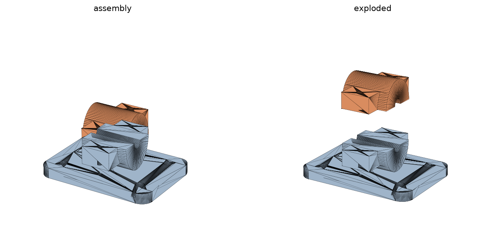

# Ceiling wire holder — pass-through cable clamp

A ceiling-mounted bracket that holds a cable running straight through it. A flat
mounting plate screws to the ceiling; a central drum splits at the cable axis
into an integral **base** and a bolt-down **cap**. The cable passes through the
drum along its axis and the cap pinches it — a standard cable-saddle clamp.

Based on the hand sketch: mounting plate with corner screw holes + a central
drum the wire runs through.



## Files

| File | What it is |
| --- | --- |
| `wire_holder.scad` | Parametric OpenSCAD source (edit dimensions here) |
| `generate_stl.py`  | Python generator (trimesh + manifold3d) — mirrors the SCAD |
| `stl/base.stl`     | Mounting plate + lower drum half (print 1×) |
| `stl/cap.stl`      | Clamp cap (print 1×) |
| `stl/assembly.stl` | Both parts positioned — preview only, do not print |

## Printed dimensions (defaults)

- Plate: **64 × 46 × 4 mm**, rounded corners
- Overall height (plate + drum): **26 mm**
- Cable channel: **5.6 mm** dia — grips a ~**6 mm** cable (undersized 0.4 mm to pinch)
- Ceiling screws: **4 × M4** flat-head (countersunk on the room-facing underside)
- Clamp screws: **2 × M3**, ~16 mm long (self-tap into the base pilot holes)

## Fasteners

- **4 × M4** wood/anchor screws to mount the plate to the ceiling.
- **2 × M3** screws (~16 mm) clamp the cap down. They self-tap into the 2.5 mm
  pilot holes in the base — no nuts needed. For a stronger repeatable joint,
  drill the base holes out to 3.4 mm and use M3 nuts (add a hex pocket, or hold
  with pliers).

## Printing

- Orientation: both parts print flat, as generated (base on its underside, cap
  on its ear top). No supports needed.
- Material: PLA is fine indoors; **PETL/PETG or ASA** if it's near heat or an
  attic. 3–4 perimeters, ≥25% infill — this is a load path.
- Layer height 0.2 mm.

## Customising

Edit the parameters at the top of `wire_holder.scad` (or `generate_stl.py` — the
two are kept in sync) and re-export:

- `wire_dia` — set to your cable's OD. `grip` controls how hard it pinches
  (channel dia = `wire_dia - grip`); set `grip = 0` for a free-running fit.
- `plate_w` / `plate_d` / `mount_inset` — plate size and screw spacing.
- `drum_r` / `drum_l` — drum size around the cable.

### Regenerate the STLs

**With OpenSCAD** (GUI or CLI):

```bash
openscad -o stl/base.stl -D 'part="base"'  wire_holder.scad
openscad -o stl/cap.stl  -D 'part="cap"'   wire_holder.scad
# a ready-to-slice plate with both parts:
openscad -o stl/print_plate.stl -D 'part="print"' wire_holder.scad
```

**With Python** (no OpenSCAD needed):

```bash
pip install numpy trimesh manifold3d
python3 generate_stl.py
```

Both paths produce the same geometry. `generate_stl.py` verifies each mesh is
watertight before writing.
